# ManaCraft

> Mana is the power of nature!

## 概述

`ManaCraft` 是一个由Yaossg开发的mod，感谢fly25(飞空)提供的部分材质

本mod很好地支持了JEI，强烈推荐安装，因为可以借此获取绝大多数合成表，少数方块和物品还有还提供了介绍可供查阅，故而本教程不会提及

## 世界生成

### 矿物生成

矿物生成的相关参数可以在配置文件中得到默认值或加以修改，故此处不做介绍

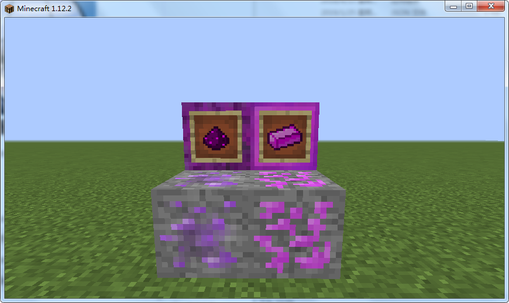

图左是魔能(mana)矿和魔能(块)
图右是山铜(orichalcum)矿和山铜锭(块)

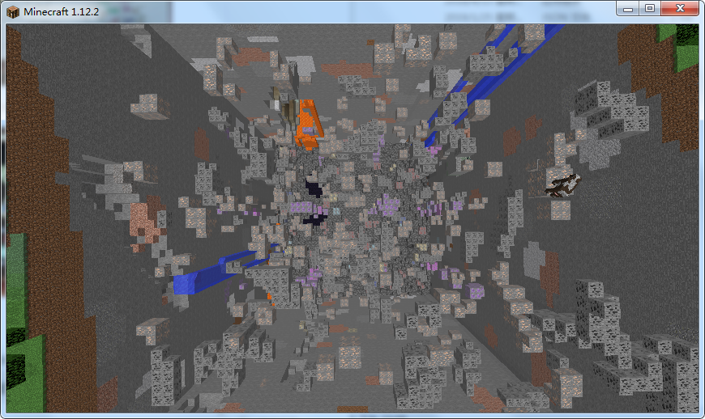

图为原版(minecraft)仅安装mana_craft的矿物生成

本模组共有三种矿脉

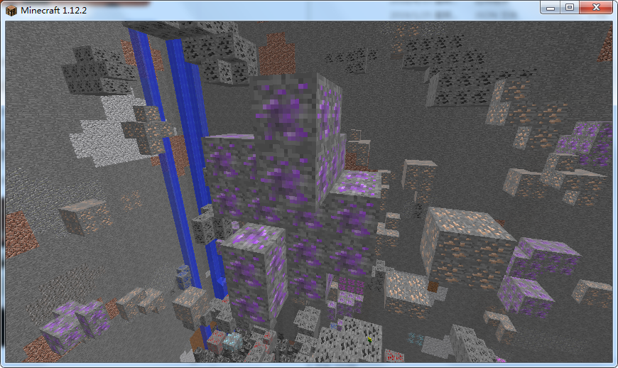

图为魔能矿脉

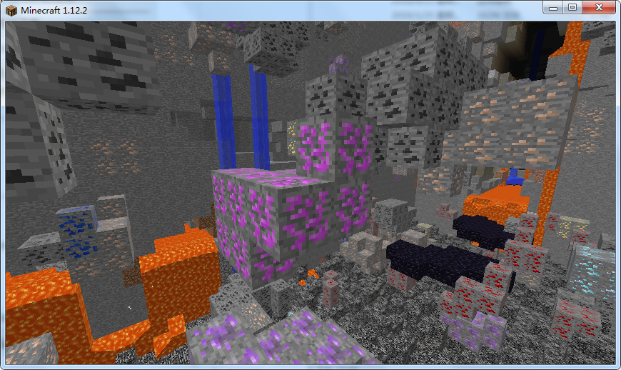

图为山铜矿

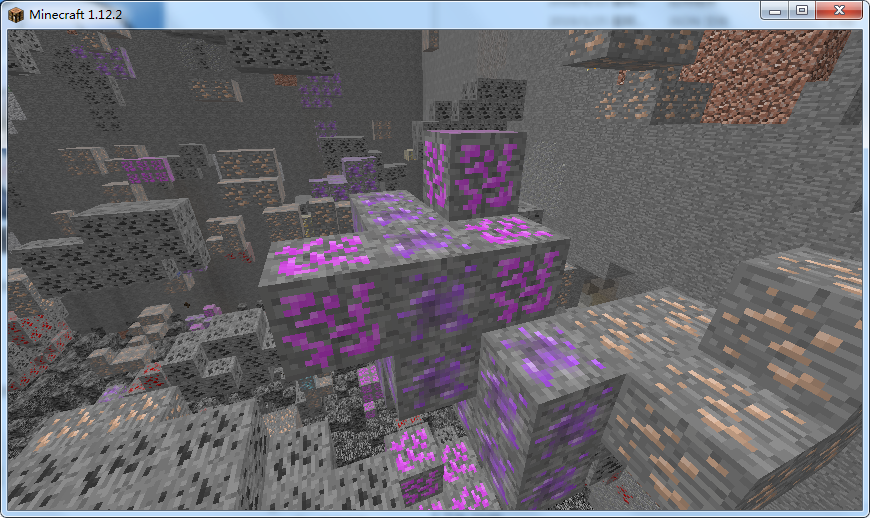

图为混合矿脉，魔能矿石和山铜矿石随机夹杂生成

#### 其他

魔能除了可以挖矿获得，也可以破坏草来获得，但是概率极低

山铜还可以用金子和魔能合成，详询JEI

### 村庄

图为魔能牧师

该专业下有四种职业：

- 魔能术士

|等级|收购|出售|
|:-:|:-:|:-:|
|1|魔能|魔能玻璃、魔能苹果|
|2|魔能猪排|机器框架|

- 魔能工具术士

|等级|收购|出售|
|:-:|:-:|:-:|
|1|魔能|魔能剪刀、附魔的魔能锹|
|2|山铜锭|附魔的魔能锄|
|3|魔能钻石|附魔的魔能镐|

- 魔能武器术士

|等级|收购|出售|
|:-:|:-:|:-:|
|1|魔能|魔能剪刀、魔能球|
|2|山铜锭|附魔的魔能法杖|
|3|魔能钻石|附魔的魔能剑|

- 魔能盔甲术士

|等级|收购|出售|
|:-:|:-:|:-:|
|1|魔能|魔能剪刀、附魔的魔能靴子|
|2|山铜锭|附魔的魔能头盔、附魔的魔能护腿|
|3|魔能钻石|附魔的魔能胸甲|

- 魔能召唤师

|等级|收购|出售|
|:-:|:-:|:-:|
|1|魔能|魔能尘|
|2|山铜锭|魔能腿、魔能身体|
|3|魔能钻石|魔能头|

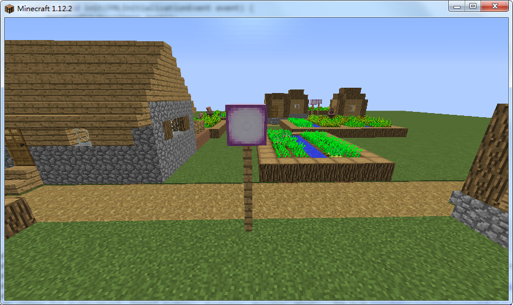

图为魔能路灯

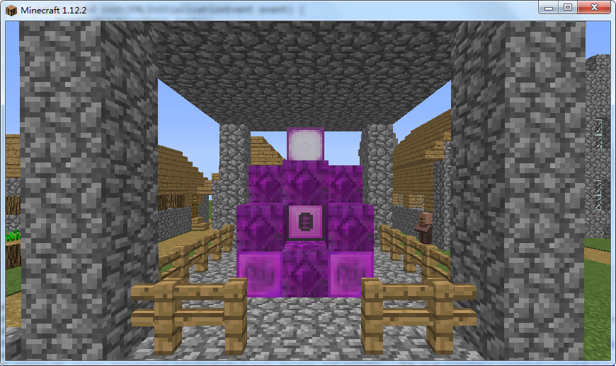

图为村庄中的魔能制造器，在这个结构里会有两个魔能牧师生成

图为魔能生物群系村庄中的魔能制造器

### 生物群系

本模组加入了四种生物群系，在这四种生物群系种本模组加入的矿物将会不同倍率地增加

普通的魔能地形，有平原和山地两种，本模组矿物在这里会双倍生成，这个地形可能会生成特色村庄

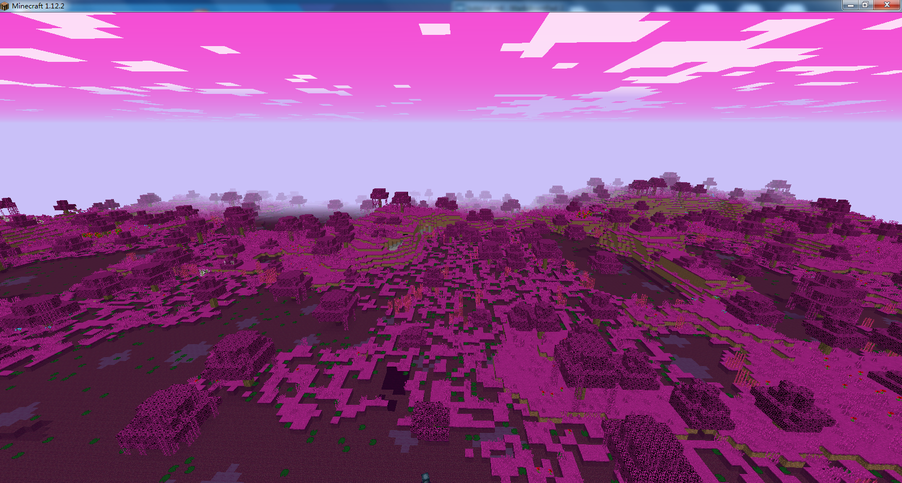

图为平原魔能

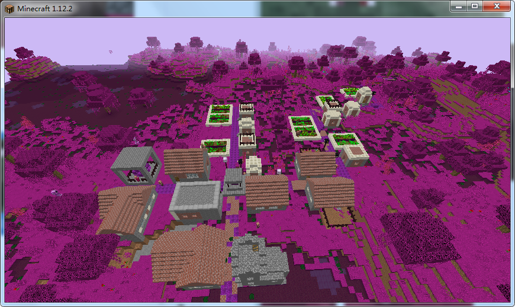

图为魔能村庄

混乱的魔能地形，有平原和山地两种，本模组矿物在这里会三倍生成

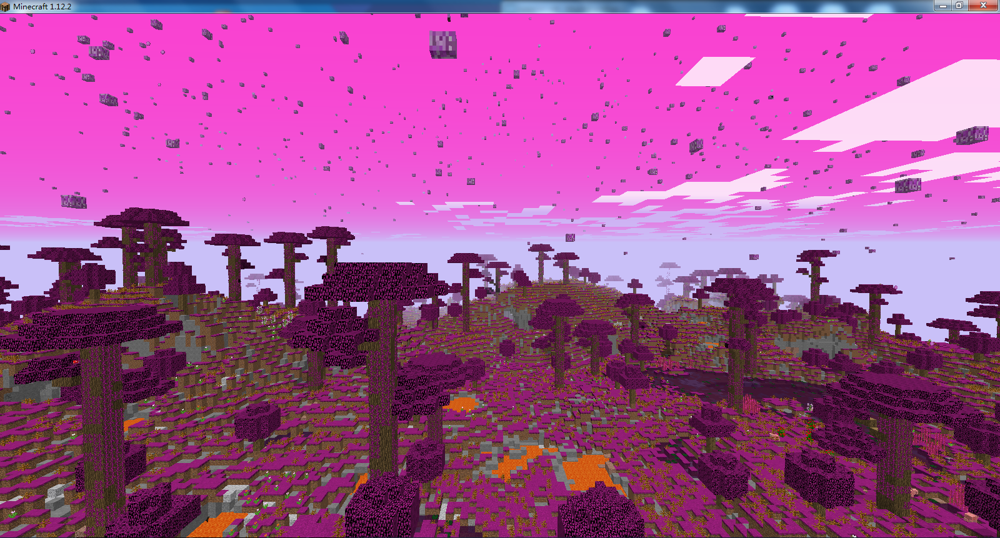

图为平原混乱魔能

## 多方块结构

### 魔能制造器

本模组最重要的合成机器

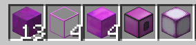

材料如上，详细步骤如下

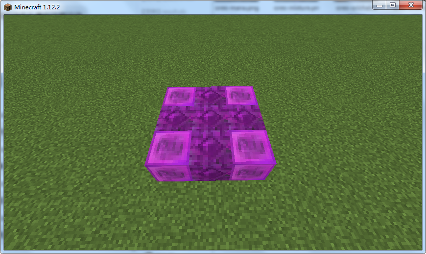
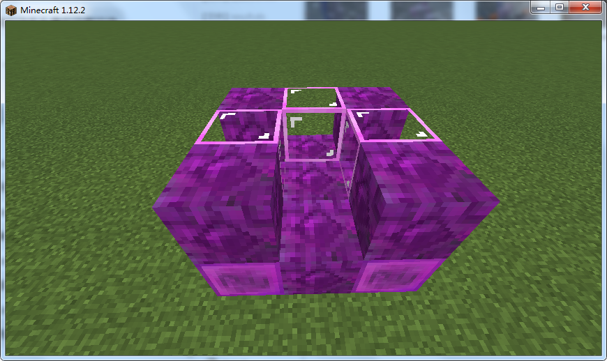
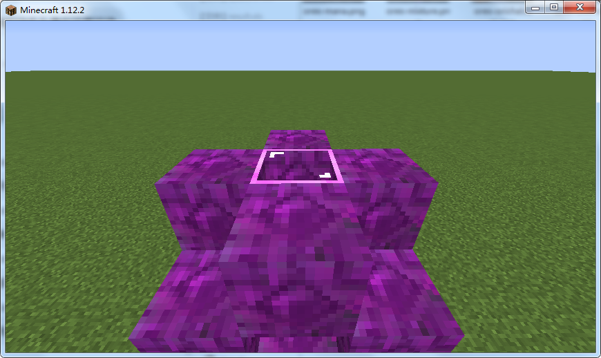

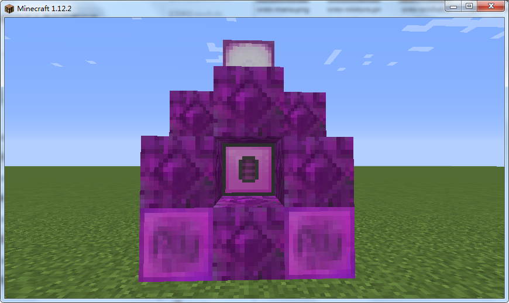

值得注意的是，魔能制造器的核心是需要最后放入的

你也可以使用魔能制造器生成器直接生成这个结构

### 魔能射手

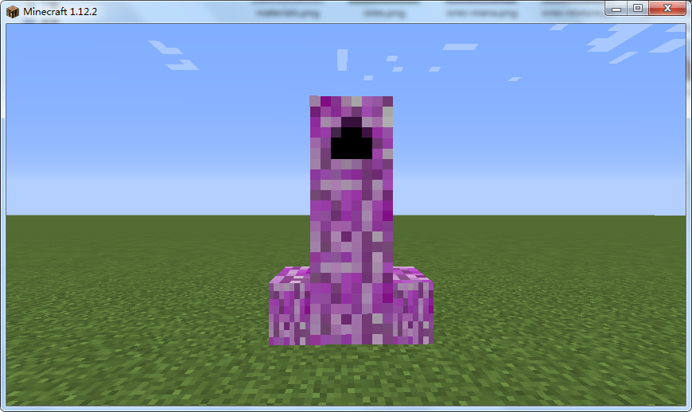

值得注意的是，魔能头是需要最后放上的

你也可以使用对应的刷怪蛋直接生成这个实体

魔能射手会发射魔能球攻击怪物，濒死时，还会自爆

## 魔能球

魔能球可以用手抛出，但是速度较慢

可以用发射器射出，速度会稍微快一点

当然，最重要的，可以用魔能法杖射出

射出之后，除非遇到方块，会穿透实体，一直飞行

值得注意的是，魔能球还是十分重要的合成材料

## 附魔

### 漂浮

魔能法杖独有的附魔，导致射出的魔能球不受重力作用，但是速度会有所减慢

值得注意的是，漂浮的球因为速度越来越慢，当速度慢到一定程度会自动消失

### 魔能召唤者

使魔能盔甲在受到伤害时可以射出魔能球

等级越高造成越多的魔能球生成

### 魔能回收者

即使没有这个附魔，所有魔能武器、工具、盔甲在耐久消耗殆尽之时都会掉落少量魔能

当有了这个附魔之后，掉落的魔能数量将会增加

等级越高，增加的魔能掉落越高

## 药水

### 魔能召唤者

拥有该药水效果可以时时刻刻在身边射出魔能球

等级越高造成越多的魔能球生成

## 机器

机器的配方和燃料注册参见[API](#api)

### 魔能制造器

在上面已经有所介绍，详细的合成配方参见JEI

特别说明：魔能制造器虽然支持I/O，但是由于制造器本身嵌在框架里面，无法连接物流管道，因此，敬请期待我的另外一个mod——Sausage's Factory，将会提供远程I/O设备——即使不贴着机器本身也可以进行I/O

### 魔能增益器

为魔能制造器，或其他机器加速，默认情况下支持原版的熔炉和酿造台，注册方式详见[API](#api)

对于魔能制造器，需要放在配置文件的指定半径内即可加速

对于其他机器，需要紧紧贴在一起才能加速

## 抢夺列表

本模组在一些原版的奖励箱中加入了宝藏，详见[这里](https://github.com/Yaossg/ManaCraft/tree/master/src/main/resources/assets/mana_craft/loot_tables/inject)

## API

ManaCraft提供的API，可以让你：

- 自制魔能工具
- 注册魔能制造器配方
- 注册魔能增益器燃料
- 注册魔能增益器可增益的机器

大部分的API都有javadoc，故不在此处多做解说

